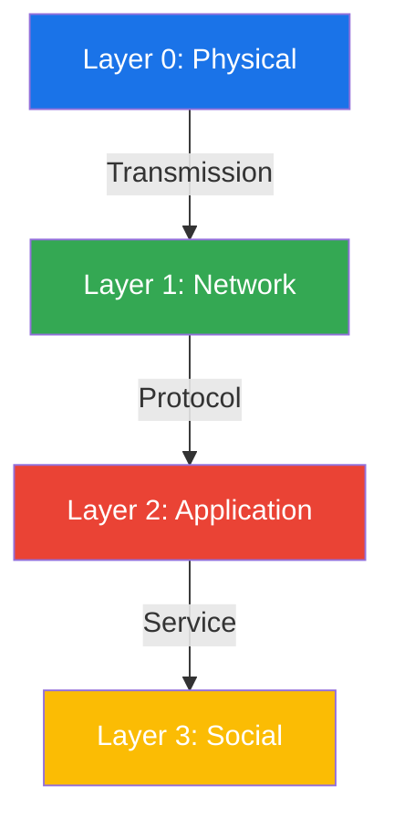
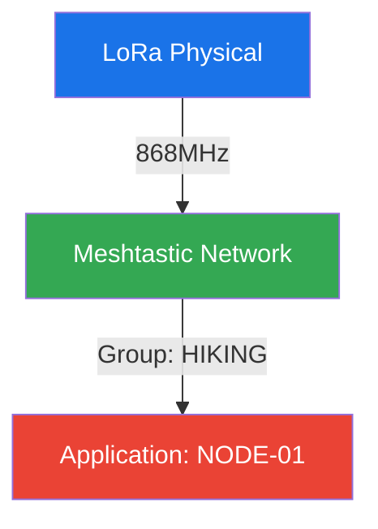
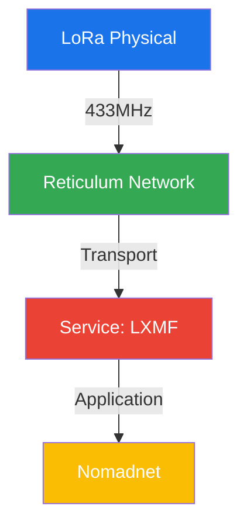
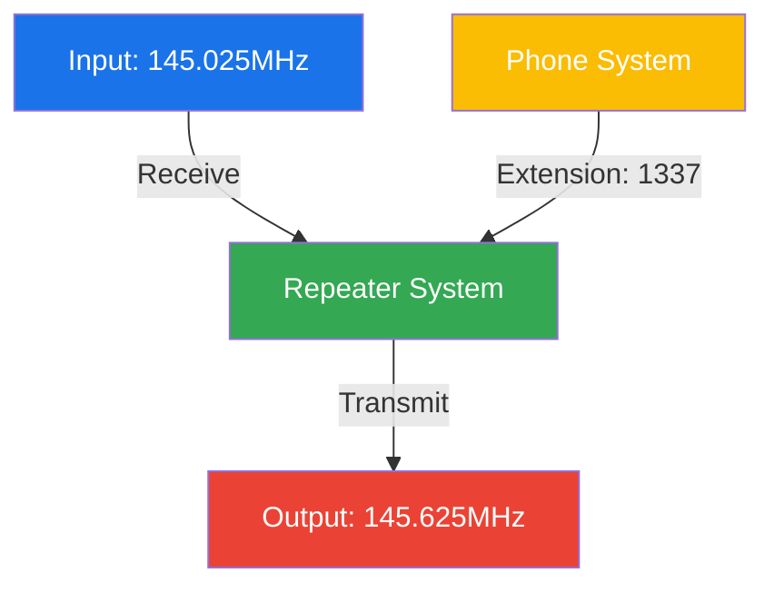

# RAMP: Resource Access Marking Protocol

## Overview

RAMP provides a unified system for marking and identifying communication endpoints across physical and digital domains. Developed for technical gatherings, it enables systematic identification of diverse network resources while maintaining human readability.

## Core Architecture

```python
class RAMPCore:
    """Core RAMP specification"""
    SYNTAX = '<layer>/<protocol>[:<parameters>][#<meta>]'
    VERSION = '1.0.0'
```

## Protocol Stack



## Protocol Mappings

### Layer 0: Physical Medium
```python
PHYSICAL = {
    'L': {'name': 'LoRa',      'params': 'frequency:mode'},
    'R': {'name': 'RF',        'params': 'frequency:mode'},
    'B': {'name': 'Bluetooth', 'params': 'uuid'},
    'N': {'name': 'NFC/RFID',  'params': 'id:type'},
    'P': {'name': 'Physical',  'params': 'location:asset'},
    'W': {'name': 'WiFi',      'params': 'ssid:security'},
    'H': {'name': 'HAMnet',    'params': 'node:subnet'},
    'V': {'name': 'Voice',     'params': 'channel:mode'}
}
```

### Layer 1: Network
```python
NETWORK = {
    'A': {'name': 'AX.25',      'params': 'callsign'},
    'D': {'name': 'DMR',        'params': 'id:group'},
    'E': {'name': 'ESP-NOW',    'params': 'mac'},
    'I': {'name': 'IP',         'params': 'v4|v6'},
    'M': {'name': 'Meshtastic', 'params': 'id'},
    'R': {'name': 'Reticulum',  'params': 'transport/node/identity'},
    'N': {'name': 'AREDN',      'params': 'node:channel'},
    'T': {'name': 'BitTorrent', 'params': 'hash:tracker'}
}
```

### Layer 2: Application
```python
APPLICATION = {
    'C': {'name': 'Callsign',    'params': 'sign:ssid'},
    'G': {'name': 'GPG',         'params': 'keyid'},
    'M': {'name': 'Matrix',      'params': '@user:home'},
    'O': {'name': 'OTR',         'params': 'fingerprint'},
    'P': {'name': 'POCSAG',      'params': 'ric:type'},
    'X': {'name': 'XMPP',        'params': 'jid'},
    'H': {'name': 'HTTP',        'params': 'host:port'},
    'T': {'name': 'Telemetry',   'params': 'type:id'},
    'S': {'name': 'SIP',         'params': 'extension:group'}
}
```

### Layer 3: Service
```python
SERVICES = {
    'F': {'name': 'Fediverse',   'params': '@user@instance'},
    'I': {'name': 'IRC',         'params': 'nick!user@host'},
    'U': {'name': 'URI',         'params': 'scheme:path'},
    'M': {'name': 'Mastodon',    'params': '@handle@instance'},
    'B': {'name': 'BitTorrent',  'params': 'magnet:hash'},
    'L': {'name': 'LXMF',        'params': 'address:type'},
    'S': {'name': 'Species',     'params': 'type:method'}
}
```

## Implementation Examples

### Meshtastic Node

RAMP: `L/M:868#HIKING-01`

### Reticulum Service

RAMP: `L/R:433/X#NOMAD`

### Voice Communication

RAMP: `R:145.025/145.625#VOICE-1337`

## Technical Parameters

```python
class RAMPValidator:
    """Comprehensive parameter validation patterns"""
    PATTERNS = {
        'MAC': r'^([0-9A-Fa-f]{2}[:-]){5}([0-9A-Fa-f]{2})$',
        'SSID': r'^[^!#;+\]\/"\t]{1,32}$',
        'IPV4': r'^\d{1,3}(\.\d{1,3}){3}$',
        'IPV6': r'^([0-9a-fA-F]{0,4}:){7}[0-9a-fA-F]{0,4}$',
        'CALLSIGN': r'^[A-Z0-9]{1,6}\d{0,2}$',
        'EXTENSION': r'^\d{4}$',
        'CALLGROUP': r'^[5-9]\d{2}$',
        'BTIH': r'^[0-9a-fA-F]{40}$',
        'URL': r'^[a-zA-Z][a-zA-Z0-9+.-]*://',
        'MAGNET': r'^magnet:\?xt=urn:btih:',
        'FREQUENCY': r'^\d+\.\d{3}[MG]Hz$',
        'RIC': r'^\d{7}$',
        'NODE_ID': r'^[0-9a-f]{8}$'
    }
```

## Physical Implementation

### Marker Specifications
```python
class RAMPMarker:
    """Physical marker specifications"""
    DIMENSIONS = {
        'min_height': 15,    # mm
        'min_width': 40,     # mm
        'qr_size': 25        # mm
    }
    
    TYPOGRAPHY = {
        'font': 'monospace',
        'weight': 'medium',
        'contrast': 'high',
        'min_size': 8        # pt
    }
    
    FEATURES = [
        'machine_readable',  # OCR-friendly
        'qr_optional',      # Extended information
        'high_contrast',    # For variable lighting
        'weather_resistant' # For outdoor use
    ]
```

### Label Templates
```python
class RAMPLabel:
    """Standard label formats"""
    FORMATS = {
        'small': {'size': '25x15mm', 'use': 'equipment'},
        'medium': {'size': '50x25mm', 'use': 'indoor'},
        'large': {'size': '100x50mm', 'use': 'outdoor'}
    }
    
    QR_FORMATS = {
        'minimal': {'data': 'ramp://<protocol>'},
        'complete': {'data': 'ramp://<protocol>#<meta>'}
    }
```

## Congress Implementation Context

Designed for technical gatherings where diverse communication systems coexist. Enables:
- Quick system identification
- Resource discovery
- Network documentation
- Access point marking

### Physical Deployment
- Adhesive labels
- Hanging signs
- Digital displays
- QR-enhanced markers

## License

MIT