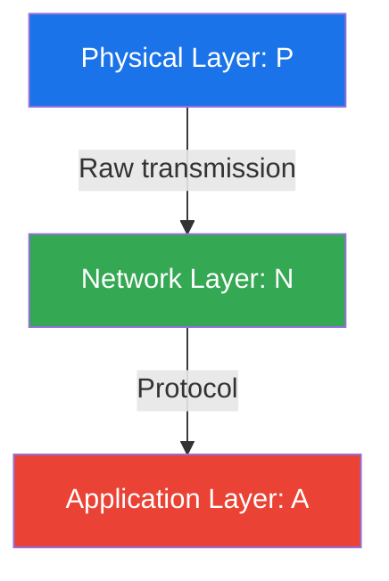
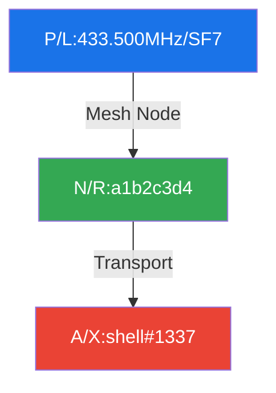

# 📡 RAMP: Resource Access Marking Protocol

## 🔍 Overview

RAMP provides a unified system for marking and identifying communication endpoints across physical and digital domains, designed specifically for hacker spaces, maker labs and technical gatherings like the Chaos Communication Congress.

## 🏗️ Core Architecture 

Basic syntax:
```
[~]<layer>/<protocol>[:<param1>[/<param2>]][#<metadata>]
```
Where `~` prefix indicates a person reference (e.g. `~N/I:10.0.0.1/24#NOC-LEAD`)

Where:
- `layer`: Single uppercase letter [A-Z]
- `protocol`: Single uppercase letter [A-Z]
- `param1`, `param2`: Protocol-specific parameter format
- `metadata`: Uppercase alphanumeric with hyphens [A-Z0-9-]
- `[]` denotes optional components

Example: `P/L:433.500MHz/SF7#MESHNODE`

### Label Format

Standard sticker (40x40mm):
```
┌────────────────┐
│      [QR]      │ <- 12x12mm QR code
├────────────────┤
│ P/L:433.500M   │ <- 8pt monospace
│ /SF7#NODE01    │
├────────────────┤
│   📡  LoRa     │ <- 10pt sans-serif
│   Node #01     │
└────────────────┘
```

### URI Format
```
ramp://<layer>/<protocol>[:<param1>[/<param2>]][#<metadata>]
```
- URI-unsafe characters must be percent-encoded
- Parameters and metadata are case-preserved
- Fragment (#) cannot contain additional fragments

## 🌐 Protocol Stack Examples

### Basic Layer Model


### Examples

## Remote Shell Access



Remote system access over LoRa-based Reticulum mesh. SF7 spreading factor balances range and speed.

```
┌────────────────┐
│      [QR]      │
├────────────────┤
│ P/L:433.500M   │
│ /SF7#SHELL01   │
├────────────────┤
│   📡  LoRa     │
│   Shell #01    │
└────────────────┘
```

## DMR Repeater System
```mermaid
graph TB
    P1[P/R:145.500MHz] -->|Input| N1[N/D:317523]
    N1 -->|Controller| P2[P/R:145.900MHz]
    P2 -->|Output| A1[A/M:@rprt145]

    style P1 fill:#1a73e8,color:white
    style N1 fill:#34a853,color:white
    style P2 fill:#1a73e8,color:white
    style A1 fill:#ea4335,color:white
```

DMR voice repeater with Matrix status updates. Input 145.500MHz, output 145.900MHz, monitoring via Matrix.

```
┌────────────────┐
│      [QR]      │
├────────────────┤
│ P/R:145.500M   │
│ #RPRT317523    │
├────────────────┤
│   📻  DMR      │
│ Repeater #01   │
└────────────────┘
```

## 📋 Protocol Mappings

### Parameter Validation Rules
```python
VALIDATION = {
    # Physical parameters
    'freq': r'^\d{3}\.\d{3}[MG]Hz$',     # e.g., 433.500MHz
    'sf': r'^SF\d{1,2}$',                 # e.g., SF7
    'mac': r'^([0-9A-F]{2}:){5}[0-9A-F]{2}$',  # MAC address
    'channel': r'^\d{1,3}$',              # e.g., 36
    'speed': r'^\d+[KMGT]$',              # e.g., 100M
    
    # Network parameters
    'ipv4': r'^\d{1,3}(\.\d{1,3}){3}$',   # IPv4 address
    'ipv6': r'^[0-9a-fA-F:]+$',           # IPv6 address
    'port': r'^\d{1,5}$',                 # Port number
    'hash': r'^[0-9a-f]{64}$',            # SHA-256 hash
    
    # Application parameters
    'user': r'^@?[a-zA-Z0-9_.-]+$',       # Username
    'room': r'^[#!][a-zA-Z0-9_.-]+$',     # Room identifier
    'host': r'^[a-zA-Z0-9.-]+$'           # Hostname
}
```

### Physical Layer (P)
```python
PHYSICAL = {
    # Radio
    'L': {'name': 'LoRa',      'params': '<freq>/<preset>',  'note': '📡 Long Range Radio',
       'presets': {
           'ST': {'name': 'Short Turbo',    'sf': 7,  'bw': 500, 'cr': '4/5', 'dr': 21.88},
           'SF': {'name': 'Short Fast',     'sf': 7,  'bw': 250, 'cr': '4/5', 'dr': 10.94},
           'SS': {'name': 'Short Slow',     'sf': 8,  'bw': 250, 'cr': '4/5', 'dr': 6.25},
           'MF': {'name': 'Medium Fast',    'sf': 9,  'bw': 250, 'cr': '4/5', 'dr': 3.52},
           'MS': {'name': 'Medium Slow',    'sf': 10, 'bw': 250, 'cr': '4/5', 'dr': 1.95},
           'LF': {'name': 'Long Fast',      'sf': 11, 'bw': 250, 'cr': '4/5', 'dr': 1.07},
           'LM': {'name': 'Long Moderate',  'sf': 11, 'bw': 125, 'cr': '4/8', 'dr': 0.34},
           'LS': {'name': 'Long Slow',      'sf': 12, 'bw': 125, 'cr': '4/8', 'dr': 0.18},
           'VLS':{'name': 'Very Long Slow', 'sf': 12, 'bw': 62.5,'cr': '4/8', 'dr': 0.09}
       }},
    'R': {'name': 'RF',        'params': '<freq>/<mode>', 'note': '📻 Generic Radio'},
    'W': {'name': 'WiFi',      'params': '<channel>/<width>', 'note': '📶 WiFi Radio'},
    'B': {'name': 'BLE',       'params': '<mac>/<type>', 'note': '🦷 Bluetooth Low Energy'},
    'Z': {'name': 'Zigbee',    'params': '<channel>/<panid>', 'note': '🕸️ Zigbee Radio'},
    
    # Wired
    'E': {'name': 'Ethernet',  'params': '<speed>/<duplex>', 'note': '🔌 Wired Network'},
    'S': {'name': 'Serial',    'params': '<baud>/<config>', 'note': '🔤 Serial Data'},
    'U': {'name': 'USB',       'params': '<version>/<class>', 'note': '🔌 Universal Serial Bus'},
    'C': {'name': 'CAN',       'params': '<speed>/<format>', 'note': '🚗 Controller Area Network'},
    
    # Special
    'Q': {'name': 'QR',        'params': '<size>/<format>', 'note': '📱 QR Code Resource'},
    'O': {'name': 'Optical',   'params': '<wavelength>/<power>', 'note': '🔦 Light-based'},
    'N': {'name': 'NFC',       'params': '<type>/<mode>', 'note': '📱 Near Field Comms'},
    'A': {'name': 'Audio',     'params': '<freq>/<channels>', 'note': '🔊 Sound-based'},
    'Q': {'name': 'QAM',       'params': '<points>/<rate>', 'note': '〰️ RF Modulation'},
    'V': {'name': 'Visual',    'params': '<format>/<fps>', 'note': '👁️ Visual Light Comms'}
}
```

### Network Layer (N)
```python
NETWORK = {
    # Internet Infrastructure
    'A': {'name': 'AS',        'params': '<asn>/<prefix>', 'note': '🌐 Autonomous System'},
    'I': {'name': 'IPv4',      'params': '<net>/<mask>', 'note': '🌐 Internet Protocol v4'},
    '6': {'name': 'IPv6',      'params': '<net>/<prefix>', 'note': '🌐 Internet Protocol v6'},
    'T': {'name': 'TCP',       'params': '<port>/<service>', 'note': '🔌 Transport Control'},
    'U': {'name': 'UDP',       'params': '<port>/<service>', 'note': '🔌 User Datagram'},
    
    # Amateur Radio
    'P': {'name': 'POCSAG',    'params': '<ric>/<type>', 'note': '📟 Paging Protocol'},
    'D': {'name': 'DMR',       'params': '<id>/<tg>', 'note': '🎙️ Digital Mobile Radio'},
    'X': {'name': 'AX.25',     'params': '<callsign>/<ssid>', 'note': '📡 Packet Radio'},
    
    # Mesh/P2P
    'M': {'name': 'Meshtastic','params': '<id>/<channel>', 'note': '🕸️ Meshtastic Mesh'},
    'R': {'name': 'Reticulum', 'params': '<hash>/<type>', 'note': '🕸️ Reticulum Mesh'},
    'Y': {'name': 'Yggdrasil', 'params': '<addr>/<subnet>', 'note': '🌳 Yggdrasil Network'},
    'C': {'name': 'cjdns',     'params': '<pubkey>/<peers>', 'note': '🕸️ cjdns Mesh'},
    'H': {'name': 'HAMnet',    'params': '<call>/<subnet>', 'note': '📡 Amateur Radio Network'},
    
    # Overlay Networks  
    'O': {'name': 'Tor',       'params': '<onion>/<port>', 'note': '🧅 Tor Network',
          'types': {'HS': 'Hidden Service', 'NODE': 'Relay Node', 'DIR': 'Directory'}},
    'N': {'name': 'I2P',       'params': '<b32>/<port>', 'note': '🧅 I2P Network'},
    'L': {'name': 'IPFS',      'params': '<cid>/<path>', 'note': '📦 InterPlanetary FS'},
}
}
```

### Application Layer (A)
```python
APPLICATION = {
    # Communication
    'M': {'name': 'Matrix',    'params': '<user>/<room>', 'note': '💬 Matrix Protocol'},
    'X': {'name': 'XMPP',      'params': '<jid>/<muc>', 'note': '💬 XMPP Protocol'},
    'I': {'name': 'IRC',       'params': '<server>/<channel>', 'note': '💬 Internet Relay Chat',
         'uri': 'irc://<server>[:<port>]/<channel>[,<key>]'},
    'L': {'name': 'LXMF',      'params': '<hash>/<type>', 'note': '📨 LXMF Messaging'},
    'E': {'name': 'Email',     'params': '<addr>/<transport>', 'note': '📧 Email Protocol'},
    
    # Services
    'H': {'name': 'HTTP',      'params': '<host>/<path>', 'note': '🌐 Web Service'},
    'G': {'name': 'Gemini',    'params': '<host>/<path>', 'note': '🚀 Gemini Protocol'},
    'S': {'name': 'SIP',       'params': '<uri>/<transport>', 'note': '☎️ Voice Over IP'},
    'F': {'name': 'FTP',       'params': '<host>/<path>', 'note': '📂 File Transfer'},
    'N': {'name': 'NNTP',      'params': '<host>/<group>', 'note': '📰 Usenet News'},
    
    # Security
    'P': {'name': 'PGP',       'params': '<keyid>/<algo>', 'note': '🔐 PGP Keys'},
    'O': {'name': 'OTR',       'params': '<fp>/<version>', 'note': '🤫 Off The Record'},
    'W': {'name': 'WireGuard', 'params': '<pubkey>/<port>', 'note': '🔒 VPN Tunnel'},
    
    # Special Purpose
    'T': {'name': 'Telemetry', 'params': '<sensor>/<interval>', 'note': '📊 Sensor Data'},
    'D': {'name': 'DNS',       'params': '<name>/<type>', 'note': '📖 Name Service'},
    'B': {'name': 'Bitcoin',   'params': '<addr>/<network>', 'note': '₿ Cryptocurrency'},
    'R': {'name': 'Radio',     'params': '<freq>/<mode>', 'note': '📻 Amateur Radio'},
    'Z': {'name': 'ZeroMQ',    'params': '<socket>/<pattern>', 'note': '🔄 Message Queue'}
}
```

## 🎪 Congress Example Labels

WiFi Access Point:
```
┌────────────────┐
│      [QR]      │
├────────────────┤
│ P/W:36/160     │
│ #NOC.AP.12     │
├────────────────┤
│   📶  WiFi     │
│   NOC AP 12    │
└────────────────┘
```

Network Segment:
```
┌────────────────┐
│      [QR]      │
├────────────────┤
│ N/I:10.128.0.0 │
│ /16#HACKCTR    │
├────────────────┤
│   🌐  Net      │
│  Hack Center   │
└────────────────┘
```

NOC Reference:
```
┌────────────────┐
│      [QR]      │
├────────────────┤
│ ~N/I:10.128    │
│ /16#NOC-LEAD   │
├────────────────┤
│   👤  Net      │
│   NOC Lead     │
└────────────────┘
```

QR Resource:
```
┌────────────────┐
│      [QR]      │
├────────────────┤
│ P/Q:128/WIFI   │
│ #GUEST-NET     │
├────────────────┤
│   📱  QR       │
│  WiFi Access   │
└────────────────┘
```

Tor Hidden Service:
```
┌────────────────┐
│      [QR]      │
├────────────────┤
│ N/O:xmpl23...  │
│ /80#HS.01      │
├────────────────┤
│   🧅  Tor      │
│  Hidden Svc    │
└────────────────┘
```

Badge Charging:
```
┌────────────────┐
│      [QR]      │
├────────────────┤
│ P/U:2.0/CDC    │
│ #CHARGE.05     │
├────────────────┤
│   🔌  USB      │
│ Charging #05   │
└────────────────┘
```
