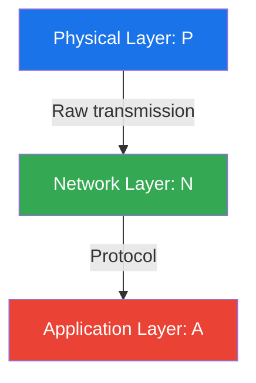
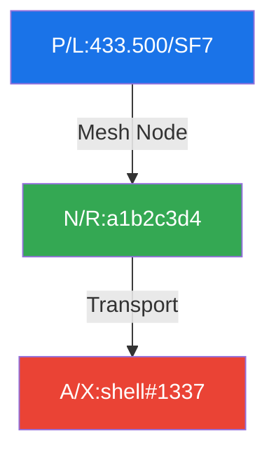

# 📡 RAMP: Resource Access Marking Protocol

## 🔍 Overview

RAMP provides a unified system for marking and identifying communication endpoints across physical and digital domains, designed specifically for hacker spaces, maker labs and technical gatherings like the Chaos Communication Congress.

## 🏗️ Core Architecture 

Basic syntax:
```
<layer>/<protocol>:<parameters>#<metadata>
```

Example: `P/L:433.500/SF7#MESHNODE`

### Label Format

Standard sticker (40x40mm):
```
┌────────────────┐
│      [QR]      │
├────────────────┤
│ P/L:433.500M   │
│ /SF7#NODE01    │
├────────────────┤
│   📡  LoRa     │
│   Node #01     │
└────────────────┘
```

### URI Format
```
ramp://<layer>/<protocol>:<parameters>#<metadata>
```

## 🌐 Protocol Stack Examples

### Basic Layer Model


### Examples

## Remote Shell Access



Remote system access over LoRa-based Reticulum mesh. SF7 spreading factor balances range and speed.

```
┌────────────────┐
│      [QR]      │
├────────────────┤
│ P/L:433.500M   │
│ /SF7#SHELL01   │
├────────────────┤
│   📡  LoRa     │
│   Shell #01    │
└────────────────┘
```

## DMR Repeater System
```mermaid
graph TB
    P1[P/R:145.500MHz] -->|Input| N1[N/D:317523]
    N1 -->|Controller| P2[P/R:145.900MHz]
    P2 -->|Output| A1[A/M:@rprt145]

    style P1 fill:#1a73e8,color:white
    style N1 fill:#34a853,color:white
    style P2 fill:#1a73e8,color:white
    style A1 fill:#ea4335,color:white
```

DMR voice repeater with Matrix status updates. Input 145.500MHz, output 145.900MHz, monitoring via Matrix.

```
┌────────────────┐
│      [QR]     │
├────────────────┤
│ P/R:145.500M   │
│ #RPRT317523    │
├────────────────┤
│   📻  DMR      │
│ Repeater #01   │
└────────────────┘
```

## 📋 Protocol Mappings

### Physical Layer (P)
```python
PHYSICAL = {
    # Radio
    'L': {'name': 'LoRa',      'params': 'freq/sf',      'note': '📡 Long Range Radio'},
    'R': {'name': 'RF',        'params': 'freq/mode',    'note': '📻 Generic Radio'},
    'W': {'name': 'WiFi',      'params': 'channel/band', 'note': '📶 WiFi Radio'},
    'B': {'name': 'BLE',       'params': 'mac/type',     'note': '🦷 Bluetooth Low Energy'},
    'Z': {'name': 'Zigbee',    'params': 'channel/pan',  'note': '🕸️ Zigbee Radio'},
    
    # Wired
    'E': {'name': 'Ethernet',  'params': 'speed/duplex', 'note': '🔌 Wired Network'},
    'S': {'name': 'Serial',    'params': 'speed/config', 'note': '🔤 Serial Data'},
    'U': {'name': 'USB',       'params': 'version/mode', 'note': '🔌 Universal Serial Bus'},
    'C': {'name': 'CAN',       'params': 'speed/format', 'note': '🚗 Controller Area Network'},
    
    # Special
    'O': {'name': 'Optical',   'params': 'type/power',   'note': '🔦 Light-based'},
    'N': {'name': 'NFC',       'params': 'type/mode',    'note': '📱 Near Field Comms'},
    'A': {'name': 'Audio',     'params': 'freq/mode',    'note': '🔊 Sound-based'},
    'Q': {'name': 'QAM',       'params': 'const/rate',   'note': '〰️ RF Modulation'},
    'V': {'name': 'Visual',    'params': 'format/fps',   'note': '👁️ Visual Light Comms'}
}
```

### Network Layer (N)
```python
NETWORK = {
    # Amateur Radio
    'A': {'name': 'AX.25',     'params': 'call/ssid',    'note': '📡 Packet Radio'},
    'D': {'name': 'DMR',       'params': 'id/group',     'note': '🎙️ Digital Mobile Radio'},
    'P': {'name': 'POCSAG',    'params': 'ric/type',     'note': '📟 Paging Protocol'},
    
    # IP-based
    'I': {'name': 'IPv4',      'params': 'addr/mask',    'note': '🌐 Internet Protocol v4'},
    '6': {'name': 'IPv6',      'params': 'addr/prefix',  'note': '🌐 Internet Protocol v6'},
    'T': {'name': 'TCP',       'params': 'port/service', 'note': '🔌 Transport Control'},
    'U': {'name': 'UDP',       'params': 'port/service', 'note': '🔌 User Datagram'},
    
    # Mesh/P2P
    'M': {'name': 'Meshtastic','params': 'id/channel',   'note': '🕸️ Meshtastic Mesh'},
    'R': {'name': 'Reticulum', 'params': 'hash/type',    'note': '🕸️ Reticulum Mesh'},
    'Y': {'name': 'Yggdrasil', 'params': 'addr/subnet',  'note': '🌳 Yggdrasil Network'},
    'C': {'name': 'cjdns',     'params': 'addr/peers',   'note': '🕸️ cjdns Mesh'},
    'H': {'name': 'HAMnet',    'params': 'call/subnet',  'note': '📡 Amateur Radio Network'},
    
    # Overlay Networks  
    'O': {'name': 'Tor',       'params': 'hash/port',    'note': '🧅 Tor Network'},
    'N': {'name': 'I2P',       'params': 'dest/port',    'note': '🧅 I2P Network'},
    'L': {'name': 'IPFS',      'params': 'hash/gateway', 'note': '📦 InterPlanetary FS'},
    
    # Experimental
    'Q': {'name': 'QKD',       'params': 'qubits/key',   'note': '🔐 Quantum Key Dist'},
    'X': {'name': 'XBee',      'params': 'addr/pan',     'note': '🐝 XBee Networks'}
}
```

### Application Layer (A)
```python
APPLICATION = {
    # Communication
    'M': {'name': 'Matrix',    'params': 'user/room',    'note': '💬 Matrix Protocol'},
    'X': {'name': 'XMPP',      'params': 'jid/muc',      'note': '💬 XMPP Protocol'},
    'I': {'name': 'IRC',       'params': 'nick/chan',    'note': '💬 Internet Relay Chat'},
    'L': {'name': 'LXMF',      'params': 'addr/type',    'note': '📨 LXMF Messaging'},
    'E': {'name': 'Email',     'params': 'addr/proto',   'note': '📧 Email Protocol'},
    
    # Services
    'H': {'name': 'HTTP',      'params': 'host/path',    'note': '🌐 Web Service'},
    'G': {'name': 'Gemini',    'params': 'host/path',    'note': '🚀 Gemini Protocol'},
    'S': {'name': 'SIP',       'params': 'user/server',  'note': '☎️ Voice Over IP'},
    'F': {'name': 'FTP',       'params': 'host/path',    'note': '📂 File Transfer'},
    'N': {'name': 'NNTP',      'params': 'host/group',   'note': '📰 Usenet News'},
    
    # Security
    'P': {'name': 'PGP',       'params': 'keyid/type',   'note': '🔐 PGP Keys'},
    'O': {'name': 'OTR',       'params': 'fp/version',   'note': '🤫 Off The Record'},
    'W': {'name': 'WireGuard', 'params': 'peer/port',    'note': '🔒 VPN Tunnel'},
    
    # Special Purpose
    'T': {'name': 'Telemetry', 'params': 'type/rate',    'note': '📊 Sensor Data'},
    'D': {'name': 'DNS',       'params': 'name/type',    'note': '📖 Name Service'},
    'B': {'name': 'Bitcoin',   'params': 'addr/type',    'note': '₿ Cryptocurrency'},
    'R': {'name': 'Radio',     'params': 'freq/mode',    'note': '📻 Amateur Radio'},
    'Z': {'name': 'ZeroMQ',    'params': 'socket/bind',  'note': '🔄 Message Queue'}
}
```

## 🎪 Congress Example Labels

WiFi Access Point:
```
┌────────────────┐
│      [QR]      │
├────────────────┤
│ P/W:5180/160   │
│ #NOC.AP.12     │
├────────────────┤
│   📶  WiFi     │
│   NOC AP 12    │
└────────────────┘
```

Network Segment:
```
┌────────────────┐
│      [QR]      │
├────────────────┤
│ N/I:10.128.0   │
│ /16#HACKCTR    │
├────────────────┤
│   🌐  Net      │
│  Hack Center   │
└────────────────┘
```

Matrix Server:
```
┌────────────────┐
│      [QR]      │
├────────────────┤
│ A/M:matrix.c   │
│ cc#SOCIAL01    │
├────────────────┤
│   💬 Matrix    │
│  Social Hub    │
└────────────────┘
```

Badge Charging:
```
┌────────────────┐
│      [QR]      │
├────────────────┤
│ P/U:2.0/PD     │
│ #CHARGE.05     │
├────────────────┤
│   🔌  USB      │
│ Charging #05   │
└────────────────┘
```

## 🖨️ Output Formats

```python
OUTPUT_FORMATS = {
    'LABEL': {
        'content': ['RAMP', 'QR', 'Notes'],
        'sizes': ['40x40mm', '60x60mm', '100x100mm']
    },
    'DIGITAL': {
        'uri': 'ramp://<specification>',
        'qr': 'binary',
        'nfc': 'ndef_record'
    },
    'DISPLAY': {
        'screen': 'animated_qr',
        'paper': 'static_label',
        'badge': 'e-ink'
    }
}
```

## 🤝 Contributing

Got improvements? Join the discussion at #ramp:c3.community!

Areas for contribution:
- Protocol extensions & mappings 🔧
- Physical format implementations 🎨
- Documentation & examples 📚 
- Real-world use cases 🌍

## 📄 License

MIT